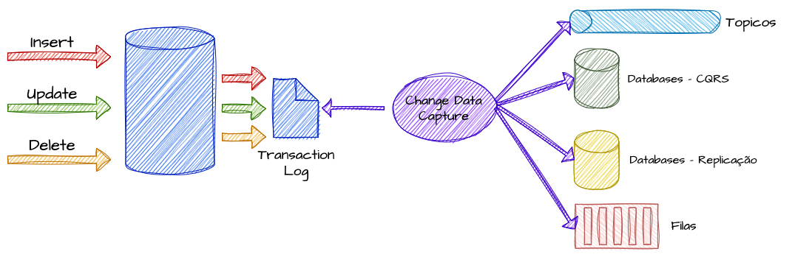

# Node Balancer

## Sobre o Projeto: "Node Balancer"

O Node Balancer é uma API escalável construída utilizando Node.js, MongoDB com replica set para alta disponibilidade, e Nginx como balanceador de carga. O sistema foi projetado para garantir resiliência, escalabilidade e alta disponibilidade. A arquitetura permite a adição manual de instâncias backend (Node.js) e garante que, em caso de falhas, o sistema continue operando sem interrupções, com a replicação automática dos dados e balanceamento de carga eficiente.

## Arquitetura - Diagrama ilustrativo



## Tecnologias

O Node Balancer utiliza as seguintes tecnologias:

- Node.js (com Express.js): Para a criação de APIs RESTful escaláveis e modularizadas.

- MongoDB Replica Set: Para garantir alta disponibilidade e redundância de dados, com failover automático.

- Nginx: Como balanceador de carga para distribuir as requisições entre as instâncias do backend.

- Docker: Para containerização das instâncias Node.js, permitindo fácil replicação e deploy.

- Monitoramento: O sistema está em processo de monitoramento para garantir a continuidade e performance da aplicação.


### Configuração Banco de Dados

#### **Verifique a Configuração do Replica Set**

Se você estiver usando o **MongoDB replica set**, a URL de conexão deve ser configurada corretamente para isso. Em um replica set, a URL de conexão precisa incluir **todos os membros** do replica set. A URL de conexão para um MongoDB replica set deve ser algo assim:

```env
MONGODB_URI=mongodb://localhost:27017,localhost:27018,localhost:27019/node-balancer?replicaSet=rs0
```

#### **Configuração do Replica Set no MongoDB**

Se você está utilizando o **MongoDB replica set**, certifique-se de que o replica set está configurado corretamente no MongoDB:

1. **Verifique se o MongoDB está rodando** no modo replica set. Você pode iniciar o MongoDB com o seguinte comando:

   ```bash
   mongod --replSet rs0
   ```

2. **Configuração do Replica Set**: Após iniciar o MongoDB, conecte-se a ele e configure o replica set:

   ```bash
   mongo
   ```

   Dentro do shell do MongoDB, inicialize o replica set:

   ```javascript
   rs.initiate({
     _id: "rs0",
     members: [
       { _id: 0, host: "localhost:27017" },
       { _id: 1, host: "localhost:27018" },
       { _id: 2, host: "localhost:27019" }
     ]
   });
   ```

3. **Verifique o status do replica set**:

   ```javascript
   rs.status();
   ```


---

